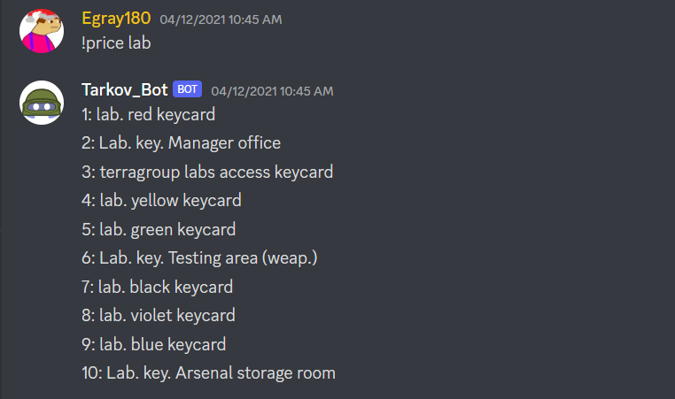
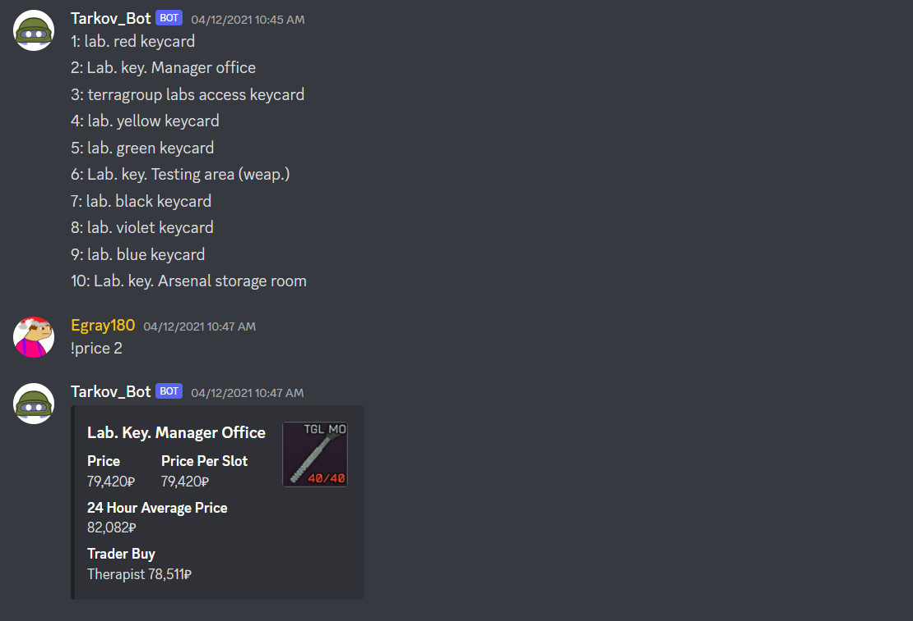
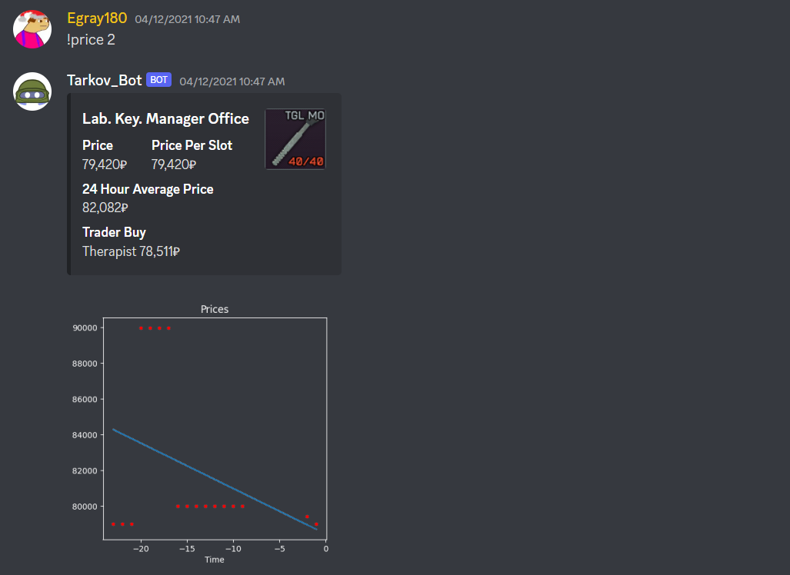
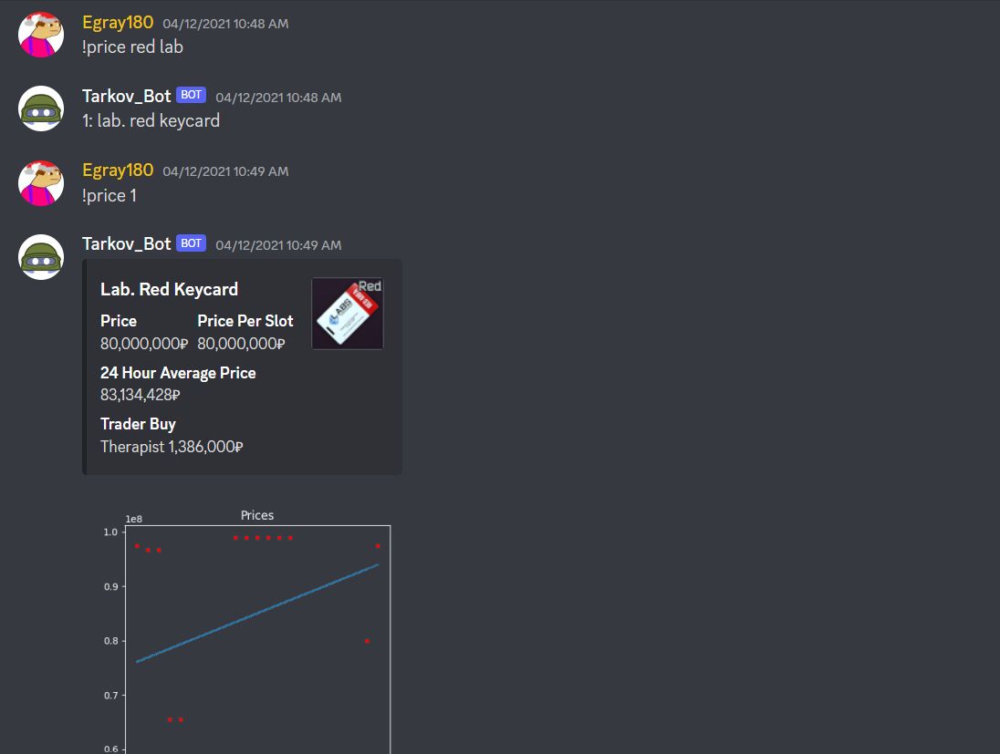
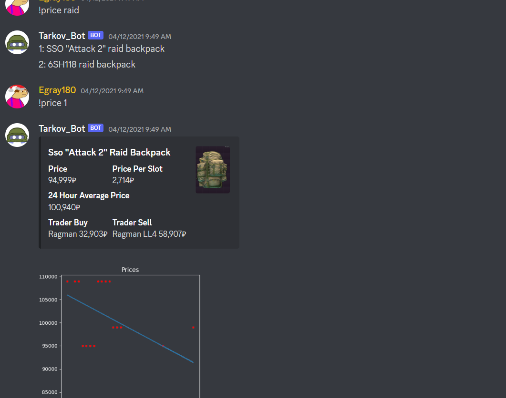

# Tarkov Market Bot
A Discord bot that monitors the price of the virtual Escape from Tarkov economy

## General Information
- Escape from Tarkov is a first person shooter with an in game economy and open market trading system
- This is a discord bot that can scrape item prices and use the Discord.py library to display information about the tarkov open market in real time 

## Features
- Implemented current price, price per slot, average 24 hour price, and trader buy/sell, with discord embed 
- Implemented a data trendline of price history with NumPy and Matplotlib 
- Created a custom data repository 
- Created a custom search function 
- Implemented web scraping with BS4 to populate repository 

## Technologies Used
- Python 
- NumPy
- BS4
- Matplotlib
- Discord.py

## Screenshots

## Usage
- Run the new_data.py file to generate the repository and do first time setup 
- Run the update.py file to continuously update the repository 
- Run the bot.py file to communicate with the discord servers for bot functionality 

## Acknowledgements

- This project was made in collaboration with [@EthanGray](https://github.com/Egray180)

## Contact
Created by [@JoshuaLuo](https://github.com/Joshua-z-Luo) - feel free to contact me at jla818@sfu.ca
